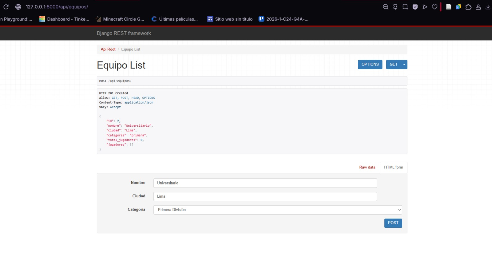
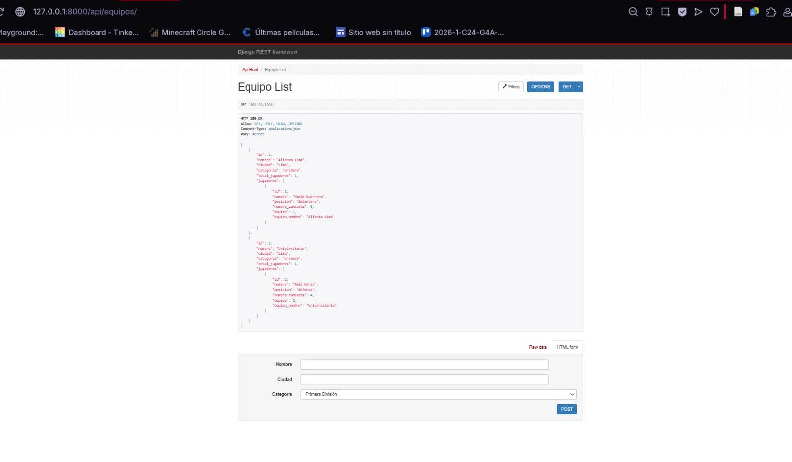
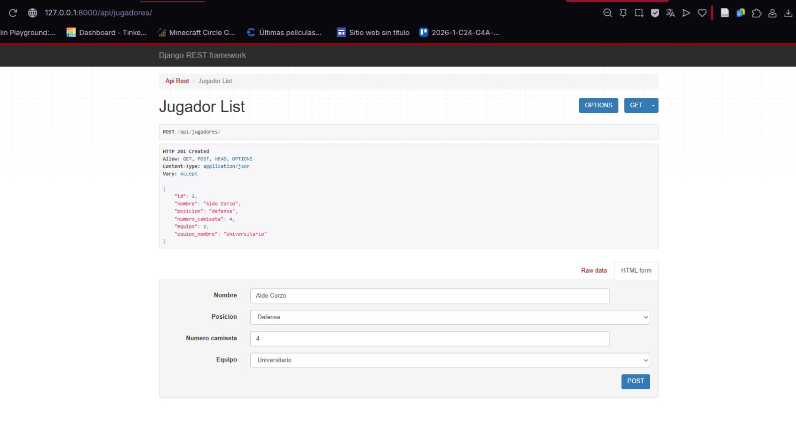
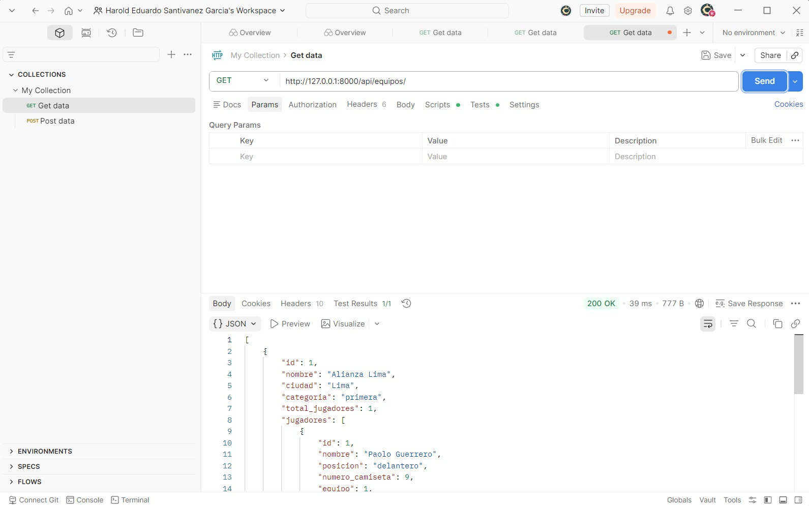
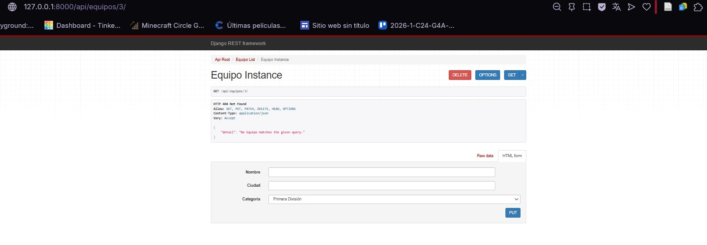
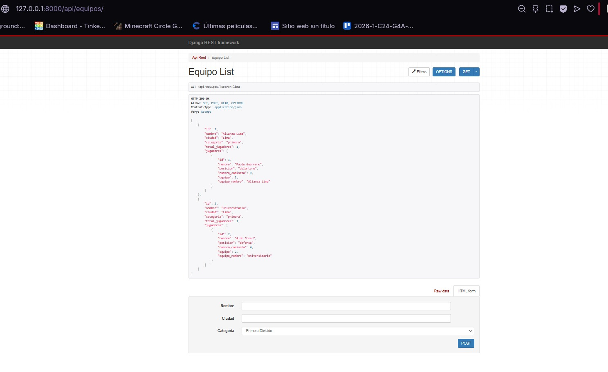

# Sportify API
**Autor:** Harold Eduardo Santivañez Garcia

## Descripción
API REST para administrar equipos deportivos y sus jugadores. Permite realizar operaciones CRUD sobre equipos y jugadores, con búsqueda por filtros.

## Tecnologías usadas
- Python 3.x
- Django 5.x
- Django REST Framework
- SQLite

## Instrucciones para ejecutar el servidor

```bash
git clone https://github.com/haroldsantivanez-ship-it/sportify_api.git
cd sportify_api
python -m venv venv
venv\Scripts\activate
pip install django djangorestframework
python manage.py migrate
python manage.py runserver
```

## Endpoints disponibles

### Equipos
| Método | Endpoint | Descripción |
|--------|----------|-------------|
| GET | `/api/equipos/` | Lista todos los equipos |
| POST | `/api/equipos/` | Crea un equipo |
| PUT | `/api/equipos/{id}/` | Edita un equipo |
| DELETE | `/api/equipos/{id}/` | Elimina un equipo |
| GET | `/api/equipos/?search=lima` | Busca equipos |

### Jugadores
| Método | Endpoint | Descripción |
|--------|----------|-------------|
| GET | `/api/jugadores/` | Lista todos los jugadores |
| POST | `/api/jugadores/` | Crea un jugador |
| PUT | `/api/jugadores/{id}/` | Edita un jugador |
| DELETE | `/api/jugadores/{id}/` | Elimina un jugador |
| GET | `/api/jugadores/?search=delantero` | Busca jugadores |

## Capturas de funcionamiento

### POST - Crear equipo (HTTP 201 Created)


### POST - Crear jugador (HTTP 201 Created)


### GET - Listar equipos con jugadores anidados


### GET - Listar equipos desde Postman (200 OK)


### GET - Detalle equipo (404 Not Found)


### GET - Búsqueda por ciudad (search=lima)
